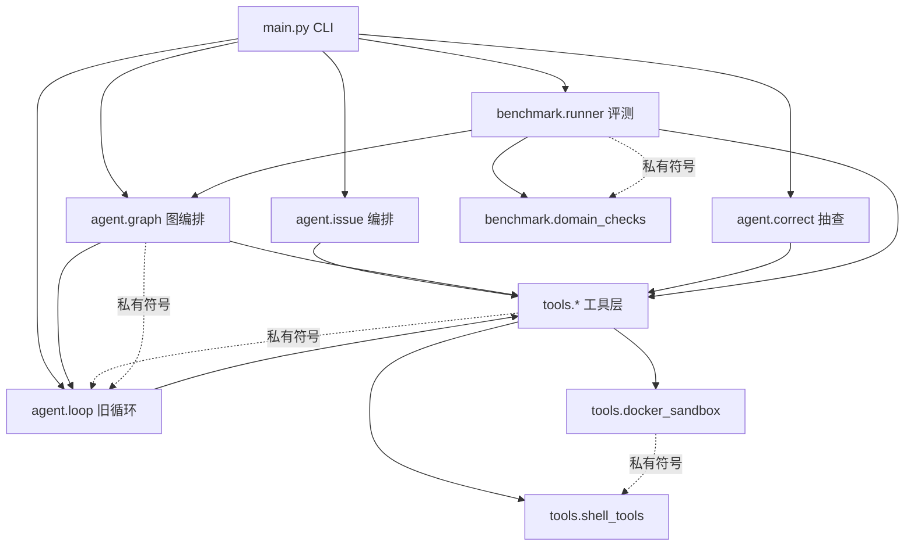

# Brooks-Lint Health Dashboard

**Mode:** Health Dashboard
**Scope:** Knowledge-Augmented Autonomous Coding Agent（main@afa4fed，工作树干净）
**Composite Score:** 74/100

> 评分规则说明：本机 `_shared/common.md` 缺失（仅 brooks-lint 下有 decay-risks/test-decay-risks），
> 扣分采用确定性规则 Critical −15 / Warning −8 / Suggestion −4，各维度按 cap 内发现集扣分、
> 底 0，PR 维度因无 diff 跳过并按 guide 重分配权重（Arch 0.40 / Debt 0.33 / Test 0.27）。
> 同一发现集下两次运行结果一致。

| Dimension | Score | Top Finding |
|-----------|-------|------------|
| Code Quality (PR) | skip | 无未提交 diff |
| Architecture | 69/100 | 跨模块私有符号 3 处 7 个（重构即静默破坏） |
| Tech Debt | 73/100 | REVIEW_CONTEXT_PROBES 硬编码兄弟项目探针，全仓库误报"缺失"证据 |
| Test Quality | 84/100 | 937 条断言几乎全部无 message（Assertion Roulette 面广） |

## Module Dependency Graph

虚线 = 跨模块私有符号依赖（R5：重构任一被引私有函数即静默破坏下游）。

## Top Findings (max 5)

1. 🔴 **[Debt/R2] REVIEW_CONTEXT_PROBES 硬编码兄弟项目探针** —
   Symptom：`agent/issue.py:85` 探针清单写死 `config/identity_map.json`、`data/*.txt` 等兄弟项目路径。
   Source：W8 域任务审查证据面按单一仓库定制后未抽象。
   Consequence：任何其它仓库（dateutil/markdown-it-py 实测）的 Reviewer 都收到无关"关键路径缺失"证据，误导审查结论。
   Remedy：探针改为"父目录存在才探测"或环境变量可配置（KA_REVIEW_PROBES）。

2. 🔴 **[Arch/R5] benchmark setup 与基线/判定跨容器，环境蒸发** —
   Symptom：`benchmark/runner.py:65` setup 在独立 sandbox_executor 容器执行，with 退出即销毁；:107 基线另起容器。
   Source：E1 实现时按"每阶段一容器"落地的副作用。
   Consequence：case.setup_commands 的 pip install 全部失效，基线/判定因环境缺口误判（P0-1 修复实际未达设计意图）。
   Remedy：setup+基线+Agent run+判定共享同一 sandbox_executor 上下文。

3. 🟡 **[Arch/R5] 跨模块私有符号 3 处 7 个**（graph←loop 3 个；docker_sandbox←shell_tools 3 个；runner←domain_checks 1 个）—
   Symptom：`agent/graph.py:17`、`tools/docker_sandbox.py:19`、`benchmark/runner.py:8`。
   Source：复用优先于边界。
   Consequence：重构任一私有函数静默破坏下游（run_host 公开化已示范修法）。
   Remedy：提升为公开 API 并写契约 docstring。

4. 🟡 **[Debt/R1] 编排长函数** —
   Symptom：`agent/issue.py:312` run_issue_agent 90 行（克隆/分支/图运行/红线/审查/重试/产单七阶段）；graph decide/execute 亦长。
   Source：阶段线性堆叠。
   Consequence：改动一处需通读全函数；本轮多次修复都在该函数内精准落点靠运气。
   Remedy：按阶段拆私有函数（_prepare_repo/_run_graph_round/_finalize）。

5. 🟡 **[Test/T1] 937 条断言几乎无 message** —
   Symptom：全仓库断言风格统一无 msg 参数。
   Source：TDD 快节奏沉淀。
   Consequence：失败时需读测试体定位（本轮 G3 接线缺陷被 mock 测试掩盖即同类盲区）。
   Remedy：不为存量翻新；新增测试钉住 message，关键安全语义（红线/审批）优先。

## Recommendation

最需要关注的是 **Tech Debt 维度**的两处"门禁失效向"问题（探针硬编码、评测跨容器）——它们不是风格债而是已产生误导性证据与误判的正确性缺陷，建议优先修；Architecture 维度的私有符号公开化成本极低（run_host 模式已有先例）应随手清偿；Test 维度健康度最高，维持"新增测试带 message"的增量纪律即可。四个 brooks 单项 skill 中，最值得对 Tech Debt 跑一次完整 brooks-debt 以展开 R2/R4 的全量清单。
