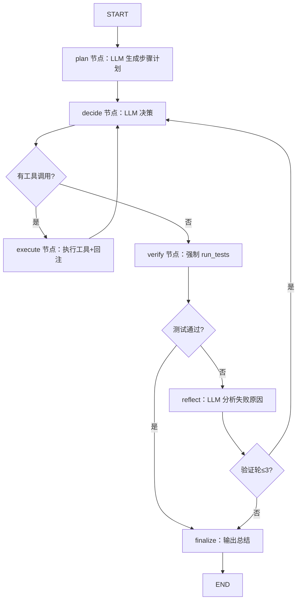

# W2 Shell + Test — 设计规格

> 日期：2026-08-15
> 窗口：W2（对应实现路径阶段 2：Shell + Test / Autonomous Coding Loop）
> 状态：设计已获用户批准（2026-08-15），本文档为批准稿
> 关联：`docs/roadmap.md` W2 窗口；需求文档第 12 节阶段 2、第 11 节 LangGraph Workflow

## 1. 背景与目标

阶段 2 目标：Agent 能**执行代码并观察结果**，形成 Analyze → Plan → Tool → Observe → Test → Debug 闭环。

- 背景：W1 已交付四个文件工具 + 最小 ReAct 循环（`run_agent`），Agent 能读/搜/改代码但不能执行与验证。W2 补齐「执行 + 测试 + 反思重试」能力。
- 目标：交付 run_command / run_tests 执行工具、git 只读工具，并以 **LangGraph 显式阶段编排**升级循环：Plan → Decide ⇄ Execute → **Verify（强制测试）** → Reflect（失败分析重试，上限 3 轮）。
- 成功标准：`pytest tests/` 全绿；给 Agent 一个含缺陷/待补测试的真实项目任务，Agent 自主完成「定位 → 修改 → 测试 → 失败 → 分析 → 再修 → 通过」闭环。

## 2. 范围

### 2.1 做

- `tools/shell_tools.py`：`run_command` / `run_tests` / `git_status` / `git_diff` / `git_log`，全部带 workspace 路径安全校验与结构化错误（ToolError）。
- `agent/graph.py`：LangGraph `StateGraph`（plan / decide / execute / verify / reflect / finalize 节点 + 条件边 + 迭代上限 + 验证轮数上限）。
- `agent/loop.py`：W1 的 `run_agent` **保留**（简单场景与回归），新增 `run_agent_graph` 入口（或独立函数）作为 W2 主循环。
- 工具集（图内可用）：W1 四文件工具 + run_command + run_tests + git 只读三件套。

### 2.2 不做（留给后续窗口）

- Docker Sandbox（W3 将 run_command 底层替换为容器执行）
- Git 写操作（commit / branch / push）与 GitHub API（W5）
- 持久化 Checkpointer（W5+ 需要时引入；W2 内存执行）
- Web UI、复杂 Multi-Agent、Code Knowledge Graph

## 3. 架构与数据流



LangGraph `StateGraph(AgentState)`，`invoke` 驱动；节点返回 state 更新，条件边按 state 路由。

## 4. 组件设计

### 4.1 Shell 工具 `tools/shell_tools.py`

| 函数 | 签名 | 行为 |
|---|---|---|
| `run_command` | `(command: str, cwd: str \| None = None, timeout: int = 60, workspace_root: str \| None = None) -> CommandResult \| ToolError` | `subprocess.run(shell=True)` 在 workspace 内 cwd 执行；超时 kill 置 `timeout=True`；stdout/stderr 各截断 100KB；返回 `CommandResult{timeout, stdout, stderr, exit_code, duration}` |
| `run_tests` | `(path: str \| None = None, workspace_root: str \| None = None) -> TestResult \| ToolError` | 用 `sys.executable -m pytest -q --tb=no [path]` 在 workspace 根执行，解析输出为 `TestResult{passed, failed, error, total, duration, failures: [TestFailure{test, message}]}`；`failures` 从 `FAILED xxx - reason` 行提取 |
| `git_status` | `(workspace_root: str \| None = None) -> GitStatus \| ToolError` | `git status --short` 解析为 `GitStatus{clean: bool, changes: list[str]}` |
| `git_diff` | `(workspace_root: str \| None = None) -> GitDiff \| ToolError` | `git diff --stat` + `git diff`（截断 100KB），`GitDiff{stat: str, diff: str}` |
| `git_log` | `(count: int = 10, workspace_root: str \| None = None) -> GitLog \| ToolError` | `git log --oneline -n count`，`GitLog{entries: list[str]}` |

**安全模型**：
- cwd 校验：所有命令的 cwd 解析后必须位于 workspace 根内（复用 `resolve_workspace_path` 语义）。
- 命令内容不限（用户已确认：任意命令 + workspace cwd + 超时；隔离由 W3 Docker 提供）。
- git 工具若目标不是 git 仓库，返回含 stderr 的 ToolError（结构化，Agent 可观察）。
- run_tests 使用 `sys.executable` 保证与当前解释器一致（venv 内 pytest）。

### 4.2 LangGraph 编排 `agent/graph.py`

**AgentState**（`typing.TypedDict`）：

```python
class AgentState(TypedDict):
    task: str
    plan: list[str]                 # plan 节点产出
    messages: list[dict]            # OpenAI 消息序列（含 tool 回注）
    steps: list[AgentStep]          # 复用 W1 AgentStep
    iteration: int
    verify_rounds: int
    test_result: TestResult | ToolError | None
    final_answer: str
    status: str                     # "running" | "done" | "limit"
```

**节点**：

| 节点 | 职责 |
|---|---|
| `plan_node` | 专用 prompt 调 LLM（不带工具），解析 content 中 JSON 数组为 `plan`；解析失败则 `plan=["（计划生成失败，直接执行）"]`，不中断 |
| `decide_node` | 带全部工具 schema 调 LLM（prompt 引用 plan 与验证轮数）；有 `tool_calls` → 路由 execute，否则 → 路由 verify；`iteration += 1` |
| `execute_node` | 复用 W1 `_dispatch` 执行全部 tool_calls，`_result_to_text` 回注 messages，追加 steps |
| `verify_node` | `run_tests(workspace_root)` → `test_result` 入 state；通过（failed==0 and error==0）→ finalize，否则 → reflect（`verify_rounds += 1`） |
| `reflect_node` | 专用 prompt 携带失败详情（failures 列表）调 LLM，要求分析原因并给出下一步修复方向；分析文本作为 assistant 消息注入 messages → decide |
| `finalize_node` | `final_answer` = 最后 decide 的 content（或达上限说明）；`status` 置 done/limit |

**上限**：`max_iterations=20`（decide 总轮次）、`max_verify_rounds=3`。任一超限 → finalize（status="limit"）。

**入口**：`run_agent_graph(task, llm, max_iterations=20, max_verify_rounds=3, workspace_root=None) -> AgentGraphResult`

```python
@dataclass
class AgentGraphResult:
    plan: list[str]
    steps: list[AgentStep]
    final_answer: str
    iteration_count: int
    verify_rounds: int
    stopped_by_limit: bool
    test_results: list[TestResult | ToolError]   # 每次 verify 的结果（时间序）
```

### 4.3 保留 `agent/loop.py`

W1 的 `run_agent` 不动（回归保障）；W2 图复用其 `_dispatch` / `_result_to_text` / `_build_tools`（从 loop 导入或抽到共享位置——**优先从 loop 导入，不搬移**，最小改动）。

## 5. 外部依赖

| 依赖 | 说明 | 方案 |
|---|---|---|
| langgraph 1.2.6 | 图编排 | 断网 vendoring：从 `D:\CodexPython312\Lib\site-packages` 复制 langgraph + langgraph_checkpoint + langgraph_prebuilt + langgraph_sdk + langchain_core（含 dist-info）进 `.venv`（已确认存在，Python 3.12 同版本） |
| pytest 9.1.1 | 测试与 run_tests 后端 | 已在 venv（W1 安装） |

## 6. 测试策略（TDD）

**Seam（待用户确认）**：`run_command` / `run_tests` / `git_status` / `git_diff` / `git_log` 公共函数 + `run_agent_graph(task)`。

- `tests/test_shell_tools.py`
  - run_command：成功（echo）、失败（exit 1）、超时（`ping -n 5 127.0.0.1` 配短 timeout）、cwd 越界拒绝、输出截断（大输出）
  - run_tests：在 tmp 项目上构造通过/失败/收集错误三种 pytest 场景，断言计数与 failures 解析
  - git 工具：在 tmp 目录 `git init` 构造变更场景，断言 status/diff/log
- `tests/test_graph.py`（MockLLMClient 脚本驱动）
  - 完整成功路径：plan → decide(read_file) → decide(无工具) → verify 通过 → finalize
  - 失败修复路径：decide(write_file 修复) → decide(无) → verify 失败 → reflect → decide(再修) → decide(无) → verify 通过；断言 verify_rounds==2 与 test_results 时间序
  - 迭代上限：一直 tool_calls 到 max_iterations → stopped_by_limit
  - 验证上限：verify 持续失败到 max_verify_rounds → stopped_by_limit

## 7. 验证计划

1. `pytest tests/` 全绿（W1 27 项回归 + W2 新增）。
2. 重新复制 `D:\AI project\camera man` 到 `workspace/demo-project`（用户上次选择不入库，演示时再放）。
3. 真实任务演示（deepseek-v4-flash）：如「为 demo-project 的 storage.py 补充一个边界测试（如空 events 查询）并跑通全量测试」——观察 Agent：计划 → 搜索/读取 → 写测试 → verify 失败/通过 → 反思修复 → 最终全绿。
4. 人工核对：修改正确、测试真实有效、未越界。

## 8. 风险与取舍

| 取舍 | 决策 | 理由 |
|---|---|---|
| LangGraph 引入 | W2 就用 StateGraph 显式编排 | 用户选定（架构前瞻）；plan/verify/reflect 节点化满足需求 U-06 显式规划；W7 可观测与 W8 审批的载体 |
| verify 强制闭环 | Agent 声称完成后图强制跑测试 | 与纯 ReAct 的核心区别：测试不是可选项 |
| run_agent 保留 | 不删除、不搬移 `_dispatch` | 回归保障 + 最小改动（Karpathy 精准修改） |
| run_command 任意命令 | 不加白名单 | 用户选定；W3 容器化时加隔离，接口不变（LocalExecutor → DockerExecutor 模式） |
| pytest 输出解析 | `-q --tb=no` + 正则 | 轻量；pytest 版本已锁定 9.1.1；若格式漂移由测试兜底 |
| vendoring langgraph | 复制 site-packages 包 | 断网环境唯一可行方案；同 Python 3.12 版本兼容 |

## 9. 遗留问题

- demo-project 不入库（用户决定）：W2 演示时重新复制 camera man；W2 结束后再次清理。
- 若 langgraph vendoring 后 import 失败（依赖缺失），fallback 评估：从兄弟项目/其他环境补齐依赖包，或调整图实现（向用户报告后决策）。
- W2 的 git 只读工具在无 .git 的 workspace 返回 ToolError——演示时如需 git 场景，在 workspace 内建临时 git 仓库。
