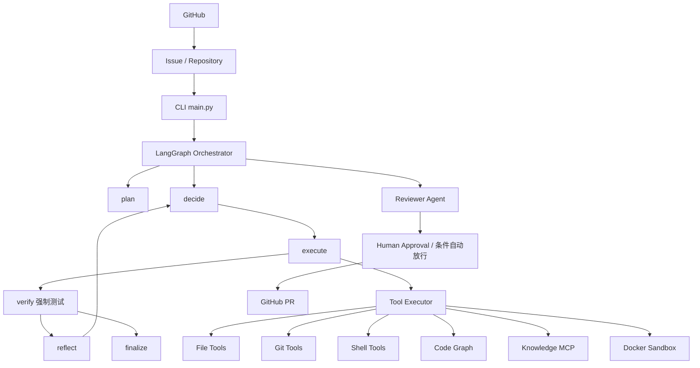

# Knowledge-Augmented Autonomous Coding Agent

> 领域知识增强的自主编程 Agent
>
> 基于 LangGraph、MCP、Knowledge Graph、Docker Sandbox 与 GitHub Workflow 的 Autonomous Software Engineering Agent

一个能够**自主完成真实 GitHub Issue** 的编程 Agent：理解真实代码仓库、调用工具、操作隔离环境、执行代码、观察结果、根据反馈迭代修复，经独立审查与人工审批后产出 GitHub Pull Request。在通用 Coding Agent 能力之上，核心特色是**双知识检索**——同时调用代码知识（AST 代码图）与可插拔的领域知识源（经 MCP 接入的知识服务）。

> 项目状态：W0-W8 窗口全部完成；2026-08-30 完成全量代码审查并修复 2 Critical / 18 Important / 35 Minor。全量回归 391 passed / 3 skipped / 0 failed。能力边界与实测战绩见 [docs/2026-08-30-project-overview.md](docs/2026-08-30-project-overview.md)。

## 最终目标链路

```text
GitHub Issue
→ Repository Analysis
→ Domain Knowledge Retrieval
→ Task Planning
→ Code Modification
→ Test
→ Failure Analysis
→ Iterative Repair
→ Code Review (独立 Reviewer)
→ Human Approval (审批门禁)
→ GitHub Pull Request
```

## 能力等级（Level 1-4 全部达成）

| 等级 | 名称 | 能力 | 达成证据 |
|------|------|------|----------|
| L1 | Code Tool Agent | list_files / read_file / search_code / write_file / edit_file / run_command / run_tests | 真实 LLM 读取-理解-修改-确认闭环 |
| L2 | Autonomous Coding Loop | LangGraph 显式规划/执行/验证/反思/重试 | 真实缺陷任务修复闭环（含失败重试与因果验证） |
| L3 | Sandbox + Repository | Docker 沙箱 / Git Clone / 独立 Workspace / 六维资源限制 | 任务全程容器化，容器内测试全绿，无残留 |
| L4 | GitHub Issue → PR | GitHub API 全链路 + 审批门禁 | 多个真实仓库 Issue 修复；真实 PR 交付 |

## 核心特色：双知识检索

Agent 在决策阶段同时持有两类知识工具：

- **代码知识**：Python AST 解析（module/class/function/import/calls，支持 async）→ 内存 CodeGraph → 五类查询（calls / inheritance / imports / module_of / symbols）；
- **领域知识**：`search_knowledge` 经 stdio MCP 子进程接入**可插拔知识服务**（`KA_KNOWLEDGE_MCP*` 配置化；未配置时优雅降级为工具级提示，不阻塞任务）。

## 架构



## 技术栈

| 层级 | 方案 |
|------|------|
| Agent | Python 3.12+ / LangGraph / OpenAI 兼容 LLM（双供应商可切换） |
| Code Understanding | Python AST + ripgrep（代码图五类查询） |
| Tools | Filesystem / Shell / Git / GitHub API（gh CLI）/ MCP |
| Runtime | Docker（一个任务一个沙箱，cap-drop 硬化） |
| Evaluation | 自定义 Benchmark（六类案例） / LLM-as-a-Judge / 基线预检 / 双口径 Resolution Rate |
| Observability | OpenTelemetry / Langfuse v4（events 通道 + ClickHouse 直查导出） |
| 测试 | pytest（TDD：red → green） |

## 目录结构

```
├── main.py                # CLI：--graph / --issue / --approve / --benchmark / --compare / --trace-report
├── agent/                 # Agent 核心（LangGraph 图、ReAct 循环、Issue 编排、LLM 客户端）
├── tools/                 # 工具层（File / Shell / Docker 沙箱 / GitHub / 审批单 / 代码图 / MCP 知识客户端 / trace）
├── benchmark/             # 评测（loader / runner / judge / report + cases 案例库）
├── tests/                 # 测试套件（391 项；docker/mcp 标记条件跳过）
├── docs/                  # roadmap / devlog / specs / plans / analysis / 审查报告
├── Dockerfile             # 沙箱基础镜像 ka-sandbox:py312-v1
└── docker/langfuse/       # Langfuse v4 观测栈（六容器 compose）
```

## 快速开始

```bash
# 环境要求：Python 3.12+、ripgrep（PATH 或 RIPGREP_BIN）、Docker（沙箱/评测）
python -m venv .venv
python -m pip install -e ".[dev]"          # 评测/trace 导出另装 ".[eval]"

# 配置：复制 .env.example 为 .env 填写（opencode_go_api 等；键名说明见模板注释）
# 部署必须显式设置 KA_LLM_TIMEOUT_S（建议 120）——SDK 默认 600s 会拖垮长任务

# 运行测试
python -m pytest tests/

# 运行 Agent（workspace 内放任意真实项目）
python main.py "在 demo-project 中定位某函数并添加注释" --workspace workspace
```

### GitHub Issue 全链路（两段式审批）

```bash
# 干跑产单停等（远端零副作用；默认 docker 沙箱隔离不可信输入）
python main.py "owner/name#123" --issue --max-iterations 40

# 人工审批：approve 才 commit+push+建 PR；reject 零远端副作用
python main.py --approve output/approvals/<审批单>.json --decision approve

# 条件自动放行档（Reviewer PASS + 红线 0 + 测试全绿 + 非删除型）
python main.py --approve <审批单>.json --decision approve --auto-approve
```

### 基准评测与可观测

```bash
python main.py --benchmark --executor docker     # 六类案例评测（需 ".[eval]" 与 docker）
python main.py --compare <run_id>                # 版本对比
python main.py --trace-report <trace_id>         # 全链路 Trace 导出（JSON+MD）
```

观测栈部署：`docker/langfuse/`（六容器 compose，CHANGEME 占位符需全部替换）。

## 安全与边界

- **审批门禁**：推送唯一入口是 `--approve`；审批单含完整 diff（含未跟踪新文件内容）+ sha256 漂移检查 + 终态防重放 + reject 零副作用。
- **红线机械拦截**：命中红线模式（`KA_REDLINE_PATTERNS` 可配）的文件在进 diff/审查/审批前被强制还原。
- **凭据边界**：gh/git 写操作全部宿主执行，凭据不进沙箱；`.env` 不入库（`.gitignore` 覆盖）。
- **沙箱隔离**：Issue 内容视为不可信输入，默认容器化执行；不可信内容无宿主 shell 通路。

## 文档索引

| 文档 | 内容 |
|------|------|
| [docs/roadmap.md](docs/roadmap.md) | W0-W8 窗口路线图与验收记录 |
| [docs/devlog.md](docs/devlog.md) | 开发日志（架构决策 / 指标 / 实测记录） |
| [docs/2026-08-30-project-overview.md](docs/2026-08-30-project-overview.md) | 项目全景：开发过程 / 功能 / 进度 / 实测战绩 |
| [docs/2026-08-30-tech-stack-and-deployment.md](docs/2026-08-30-tech-stack-and-deployment.md) | 技术栈 / 知识内容体系 / Docker 部署指南 |
| [docs/2026-08-30-code-review-report.md](docs/2026-08-30-code-review-report.md) | 全量代码审查报告（2C/18IM/35Min + 修复记录） |
| docs/specs/ · docs/plans/ · docs/analysis/ | 设计规格 / 实施计划 / 分析与台账 |

## 分支与历史说明

本仓库远程以**全新初始提交**导入（安全审查后的干净快照）。本地保留完整开发历史（窗口制 171+ 提交）；领域知识服务的具体集成实现（Arknights 知识库对接、知识抽查 `--correct`、域规则判定器、域基准案例）在本地历史分支中维护，后续以 feature 分支形式回归本仓库——通用 MCP 接入接口（`KA_KNOWLEDGE_MCP*`）已在主分支就绪，回归时仅需配置对接。

## 开发规范

见 [agents.md](agents.md)：Superpowers 全套流程（brainstorming → plan → TDD → review）、窗口任务制（一个窗口 = 一个 worktree = 一个 feature 分支）、Conventional Commits。
