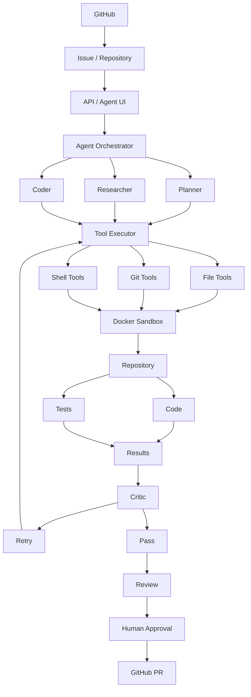

# Knowledge-Augmented Autonomous Coding Agent

> 领域知识增强的自主编程 Agent
>
> 基于 LangGraph、MCP、Knowledge Graph、Docker Sandbox 与 GitHub Workflow 的 Autonomous Software Engineering Agent

基于现有的《明日方舟》全量剧情结构化知识库、Knowledge Graph 与 LangGraph ReAct Agent，进一步构建能够**自主完成真实 GitHub Issue** 的编程 Agent：理解真实代码仓库、调用工具、操作隔离环境、执行代码、观察结果、根据反馈迭代修复，最终产出 GitHub Pull Request。

> 项目状态：W0-W8 全部完成 —— W1 本地 Workspace、W2 Shell + Test、W3 Docker Sandbox（容器化执行 + 六维资源限制 + 一个任务一个沙箱）、W4 Repository Intelligence（代码图 + Arknights 域知识双检索）、W5 GitHub Issue Agent（Issue → 沙箱工作 → Review → push 门禁的 PR 全链路；真实演示 dbader/schedule#646 修复与社区方案一致）+ 知识抽查扩展（三次提取产物 2% 抽查：来源可靠性 96.88% / 内容实用性 70.98%，main.py --correct）、W6 Evaluation（Issue Benchmark 案例库五类 + Issue Resolution Rate 核心指标 + LLM-as-a-Judge 双判定 + `--benchmark/--compare` CLI + Langfuse 部署文件与可开关 tracing，评测执行器须 docker）、W7 Observability（graph 七节点 + tool.execute/test.run + issue.run retry 指标全链路 Trace；`--trace-report` 经 ClickHouse 直查导出 JSON+Markdown 报告——真实 W6 trace 与 W7 新 trace 均验证通过；SDK 4.14.4 经 OTel 上报落库）、W8 Human-in-the-loop（两段式 --approve 审批门禁 + 独立 Reviewer + 红线机械拦截；真实远程修复里程碑：五轮迭代 → 人工批准 → 真实 PR #3；D5 评估：完全自动 PR 暂不推荐，建议条件自动放行档）。全量回归 395 passed / 4 skipped / 0 failed。两轮真实 GitHub Issue 实测（rich/jsonschema/markdown-it-py/dateutil + 兄弟项目 Issue #4）驱动的补强已全部落地（edit_file/环境声明/G1 降级/G3 钩子/G8 回传/untracked 红线等，见 docs/analysis/2026-08-29-unfinished-ledger.md）。下一步：W8 后增强收尾与知识纠错第二阶段（--apply 写回，审批通道已预留）。
> 开发规范见 [agents.md](agents.md)，窗口路线图见 [docs/roadmap.md](docs/roadmap.md)。

---

## 最终目标

```text
GitHub Issue
→ Repository Analysis
→ Domain Knowledge Retrieval
→ Task Planning
→ Code Modification
→ Test
→ Failure Analysis
→ Iterative Repair
→ Code Review
→ GitHub Pull Request
```

核心不是做"AI 写代码工具"，而是证明 Agent 能在真实软件工程环境中自主完成端到端任务。

## 能力等级（目标：做到第四阶段）

| 等级 | 名称 | 能力 | 完成标志 |
|------|------|------|----------|
| Level 1 | Code Tool Agent | list_files / read_file / search_code / write_file / run_command / run_tests | 读取 → 理解 → 修改代码 → 执行测试 |
| Level 2 | Autonomous Coding Loop | Planner / Agent Loop / Observation / Retry / Reflection / Git Diff | Task → Analyze → Plan → Tool → Observe → Test → Debug → Review |
| Level 3 | Sandbox + Repository | Docker Sandbox / Git Clone / 独立 Workspace / 资源限制 | Agent → Tool → Docker Sandbox → Repository → Code / Test / Git |
| Level 4 | GitHub Issue → PR | GitHub API 全链路 | Issue → Clone → Branch → 修改 → 测试 → Review → Commit → Push → PR |

## 核心特色：领域知识增强

与普通 Coding Agent 的关键区别——同时调用代码知识与领域知识：

```text
GitHub Issue
     │
     ↓
  Planner
     │
 ┌───┴───┐
 ↓       ↓
Repository Agent   Domain Knowledge Agent
 ↓       ↓
Code Knowledge     Arknights KG
 └───┬───┘
     ↓
 Task Context
     ↓
   Coder
```

Agent 同时调用 `search_code()` 与 `search_knowledge()`，得到 Code Context + Domain Context 后再决定如何修改。最自然的落地方式：**把现有 Arknights LLM Wiki 项目本身作为真实代码仓库**，让 Agent 完成领域逻辑类 Issue（如实体去重）。

## 最终架构



## 技术栈

| 层级 | 方案 |
|------|------|
| Agent | Python 3.12+ / LangGraph / OpenAI 兼容 LLM / Pydantic |
| Code Understanding | Tree-sitter / Python AST / ripgrep |
| Tools | Filesystem / Shell / Git / GitHub API / MCP |
| Runtime | Docker / Redis / PostgreSQL |
| Evaluation | 自定义 Benchmark（GitHub Issue） / LLM-as-a-Judge / 回归测试 |
| Observability | OpenTelemetry / Langfuse |
| Web | FastAPI / React / Next.js |
| 测试 | pytest（TDD，red → green） |

## 目录结构

```
Knowledge-Augmented Autonomous Coding Agent/
├── agents.md                     # Agent 工作规范（Superpowers 流程 / 窗口任务制 / Git 规则）
├── readme.md                     # 本文件
├── docs/
│   ├── roadmap.md                # W0-W8 实现路径路线图（窗口任务制）
│   ├── specs/                    # 设计规格（brainstorming 产出）
│   ├── plans/                    # 实施计划（writing-plans 产出）
│   └── devlog.md                 # 开发日志（架构决策 / 指标 / 遗留问题）
├── agent/                        # Agent 核心（LangGraph 图、节点、状态）
├── tools/                        # 工具层（File / Shell / Git / GitHub / MCP）
├── workspace/                    # 沙箱工作区（demo-project 等被操作仓库）
├── tests/                        # 测试套件
├── config/                       # 配置文件
└── pyproject.toml                # 项目元数据与依赖
```

## 实现路径（窗口路线图）

按《实现内容与实现路径》文档第 12 节划分为 9 个窗口，每个窗口一个独立 worktree 与 feature 分支，完整路线图见 [docs/roadmap.md](docs/roadmap.md)。

| 窗口 | 名称 | 关键交付 |
|------|------|----------|
| W0 | 项目初始化 | git 初始化、AGENTS/README/路线图、脚手架（已完成） |
| W1 | 本地 Workspace | 文件工具四件套：list_files / read_file / search_code / write_file |
| W2 | Shell + Test | run_command / run_tests / git 只读 + LangGraph 编排（plan → decide ⇄ execute → verify → reflect）（已完成） |
| W3 | Docker Sandbox | 容器化执行 + timeout / CPU / 内存 / 网络 / 文件系统限制 |
| W4 | Repository Intelligence | Code Parser → Code Knowledge Graph + 接入 Arknights KG |
| W5 | GitHub Issue Agent | Issue → Clone → Branch → Work → Test → Review → Commit → Push → PR（MVP） |
| W6 | Evaluation | Issue Benchmark 五类 + Issue Resolution Rate 核心指标（已完成） |
| W7 | Observability | 全链路 Trace + Langfuse / OpenTelemetry（已完成） |
| W8 | Human-in-the-loop | Reviewer Agent + 人工审批门禁后自动 PR（已完成） |

## 推荐的真实 Issue（用于 W5/W6 验证）

1. 普通 Bug：某 API 在特定情况下返回 500
2. 测试补充：为知识抽取模块增加边界条件测试
3. 领域逻辑 Bug：同一角色在不同章节被识别为不同 Entity（体现双知识检索价值）
4. 跨模块任务：修改实体合并逻辑并保证已有 KG 数据兼容
5. 旗舰 Demo：优化三遍 LLM 抽取 Pipeline，降低重复实体生成率并保持数据兼容

## 快速开始

> 已实现 Level 1-4 全链路：文件工具四件套 + edit_file 局部编辑 + run_command/run_tests + git 只读三件套 + 双知识检索 + Docker 沙箱 + GitHub Issue 全链路（--issue 产单停等 → --approve 人工审批推送）+ 基准评测与全链路 Trace。

```bash
# 环境要求：Python 3.12+、ripgrep（PATH 或 RIPGREP_BIN 指定）
python -m venv .venv
.venv\Scripts\python.exe -m pip install -e ".[dev]"

# 配置 LLM（复制 .env.example 为 .env 并填写）
# opencode_go_api / OPENCODE_GO_BASE_URL（默认 https://opencode.ai/zen/go/v1）/ OPENCODE_GO_MODEL（默认 mimo-v2.5）
# 部署必须显式设置 KA_LLM_TIMEOUT_S（建议 120）——未设置时 SDK 默认 600s，长任务单次请求挂起会拖垮整轮迭代

# 运行测试
.venv\Scripts\python.exe -m pytest tests/

# 运行 Agent（工作区默认 workspace/，可放入任意真实项目）
.venv\Scripts\python.exe main.py "在 demo-project 中定位某函数并添加注释" --workspace workspace
```

## 常用命令

```bash
pytest tests/ -v                 # 全量测试
pytest tests/xxx.py -v           # 单文件测试

# Issue 全链路（干跑产单停等，不推送）
python main.py "owner/name#123" --issue --max-iterations 40
# 人工审批（approve 才 commit+push+建 PR；reject 零远端副作用）
python main.py --approve output/approvals/<审批单>.json --decision approve
# 基准评测 / 版本对比 / Trace 导出（需 ".[eval]" 与 docker 执行器）
python main.py --benchmark --executor docker
python main.py --compare <run_id>
python main.py --trace-report <trace_id>
```

## 关联项目

- **Arknights LLM Wiki**（兄弟项目）：本项目的领域知识来源（Knowledge Graph / LangGraph Agent / MCP 能力），同时作为 Agent 的首个真实操作仓库。
